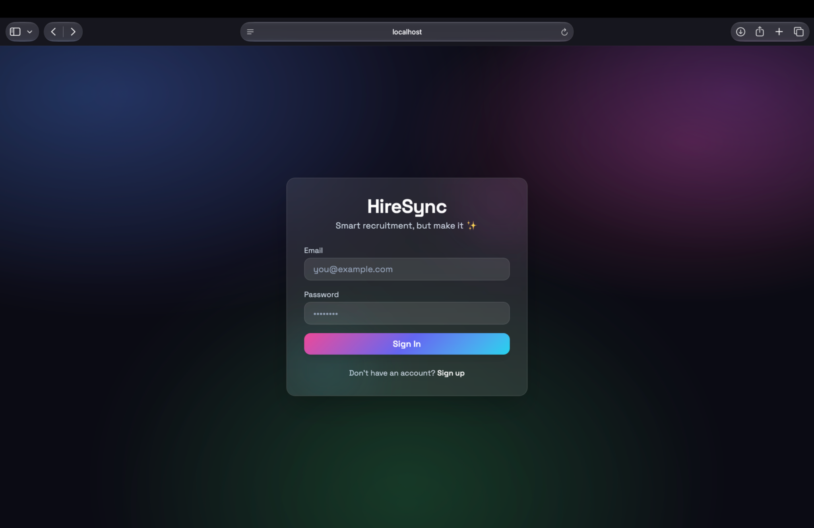
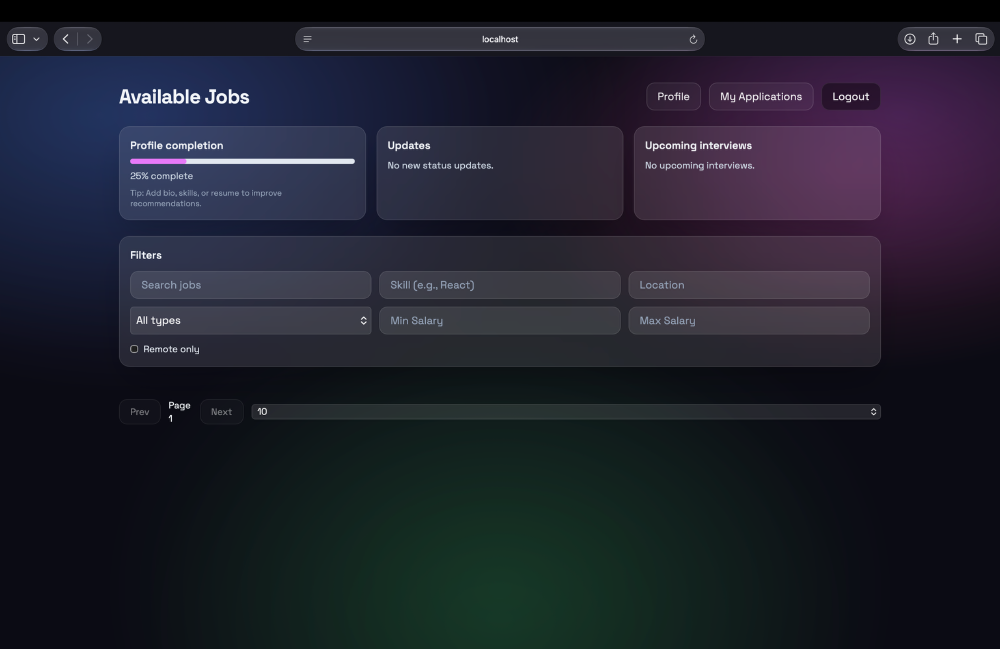
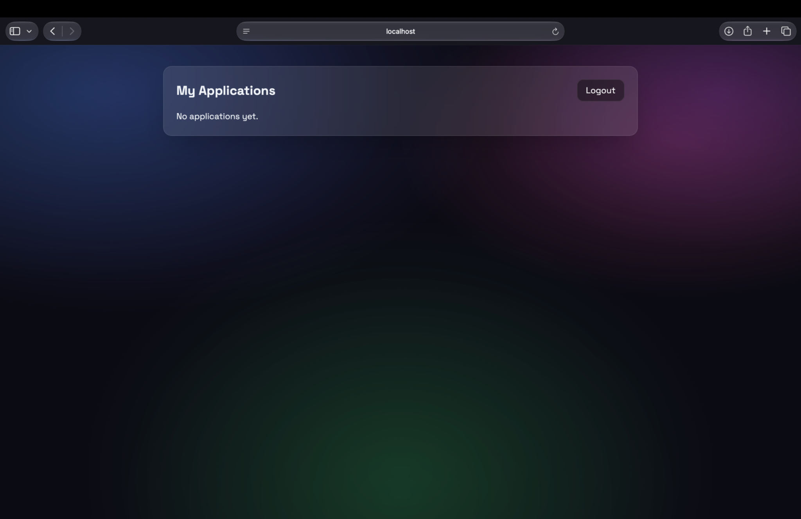
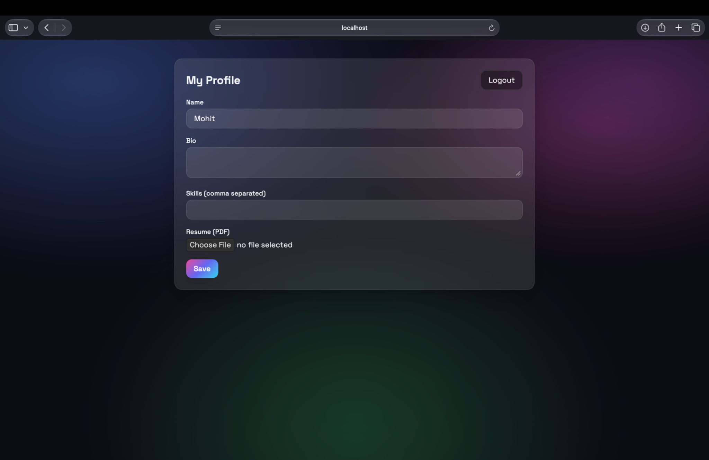
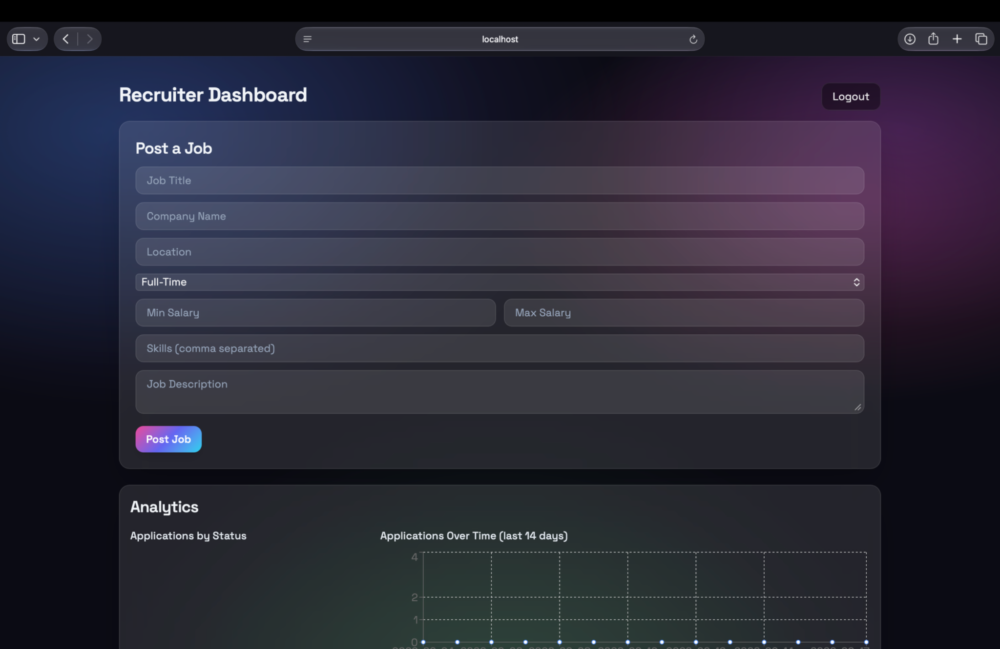

# HireSync

[](https://github.com/mohitrajjj/HireSync/actions/workflows/ci.yml)

A full-stack recruitment platform where recruiters post jobs and manage applicants, and candidates browse jobs and track their application status — built to replace the usual manual, spreadsheet-based hiring process with something real-time.

I built this solo as a MERN-stack project, with CI/CD and automated tests set up from the start.

## Screenshots

<table>
<tr>
<td width="50%"><br/><sub><b>Login</b></sub></td>
<td width="50%"><br/><sub><b>Available jobs</b></sub></td>
</tr>
<tr>
<td width="50%"><br/><sub><b>My applications</b></sub></td>
<td width="50%"><br/><sub><b>My profile</b></sub></td>
</tr>
<tr>
<td width="50%"><br/><sub><b>Recruiter dashboard</b></sub></td>
<td width="50%"></td>
</tr>
</table>

## What it does

- Role-based accounts — recruiters and students/candidates get different dashboards, with protected routes
- Recruiters can create, edit, and manage job postings (title, salary range, required skills, location)
- Candidates apply with resume upload; recruiters can filter applications and update status
- Resume uploads keep version history per user
- Recruiters get an analytics dashboard (built with Recharts) showing application and hiring activity
- Toast notifications for real-time feedback across the app

## Tech stack

**Frontend:** React (Vite), Tailwind CSS, Recharts, Vitest for testing
**Backend:** Node.js, Express, MongoDB with Mongoose, JWT auth, bcrypt, Multer for file uploads, Jest for testing
**CI:** GitHub Actions runs the backend and frontend test suites on every push and PR

## Project structure

```
HireSync/
├── backend/
│   ├── controllers/    # auth, jobs, applications, users, analytics
│   ├── models/         # User, Job, Application
│   ├── routes/
│   ├── middleware/     # auth, role checks, file upload
│   └── tests/
├── frontend/
│   ├── src/pages/       # Login, Signup, StudentDashboard, RecruiterDashboard, Profile, MyApplications
│   ├── src/components/  # JobCard, CreateJobForm, AnalyticsPanel, ApplicationChart, ProtectedRoute
│   └── src/services/    # API calls
└── .github/workflows/
```

## Running it locally

MongoDB needs to be available/configured for the backend. Start the backend first, then the frontend, in separate terminals.

Backend:

```bash
cd backend
npm install
# add a .env with MONGO_URI and JWT_SECRET
npm start
```

Runs on port `5001`. You should see a server-start message and a MongoDB connection message once it's configured correctly.

Frontend:

```bash
cd frontend
npm install
npm run dev
```

Open the localhost URL Vite prints.

Tests:

```bash
cd backend && npm test
cd frontend && npm test
```

## About me

Mohit Raj, MCA graduate from RV College of Engineering. [GitHub](https://github.com/mohitrajjj) · [LinkedIn](https://linkedin.com/in/mohit-rajj) · [LeetCode](https://leetcode.com/u/vduZBjuexI/)
